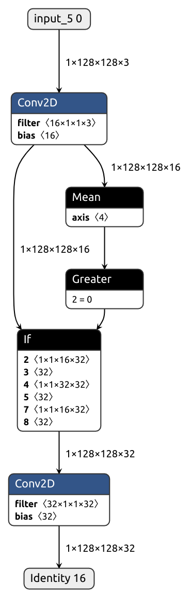

**No** **Bu**llshit **Co**nverter is a tool that lets you translate pytorch models into tensorflow graphs without losing your mind.

- Supports a wide range of architectures
  - [x] Control flow ops (If, While)
  - [x] Recurrent layers (LSTM, GRU)
  - [x] Arbitrary torch functions
- Simple
- Flexible
- Sanity-preserving, with clear mistake messaging

<!-- toc -->

## Installation
```bash
pip install nobuco
```

## Table of Contents
- [Essentials](#essentials)
- [Channel order wizardry](#channel-order-wizardry)
- [In-place operations](#in-place-operations)
- [Going dynamic](#going-dynamic)
- [So we put a converter inside your converter](#so-we-put-a-converter-inside-your-converter)

<!-- tocstop -->

## Essentials

Suppose we want to convert a pytorch module similar to this one:

````python
class MyModule(nn.Module):
    def __init__(self):
        super().__init__()
        self.conv = nn.Conv2d(3, 16, kernel_size=(3, 3), padding=(1, 1), stride=(2, 2))

    def forward(self, x):
        x = self.conv(x)
        x = nn.Hardsigmoid()(x)
        x = 1 - x[:, ::2] * x[:, 1::2]
        return x
````

The process is exactly what you would expect. Instantiate the module, create dummy inputs and call the magic function:

````python
dummy_image = torch.rand(size=(1, 3, 256, 256))
pytorch_module = MyModule().eval()

keras_model = pytorch_to_keras(
    pytorch_module,
    args=[dummy_image], kwargs=None,
    inputs_channel_order=ChannelOrder.TENSORFLOW,
    outputs_channel_order=ChannelOrder.TENSORFLOW
)
````

Aaaand done! That's all it takes to... wait, what's that?


Nobuco says it doesn't know how to handle hard sigmoid.
Apparently, it's our job to provide a node converter for either `F.hardsigmoid` or the enclosing `Hardsigmoid` module (or the entire `MyModule`, but that makes little sense). Here, we'll go for the former.

Conversion is done directly. No layers upon layers of abstraction, no obscure intermediate representation. A node converter is just a `Callable` that takes in the same arguments as the corresponding node and outputs an equivalent node in tensorflow. The converted node preserves the original node's signature, but pytorch tensors replaced with tensorflow counterparts (be that `tf.Tensor`, `KerasTensor`, `tf.Variable`, or `ResourceVariable`).

This should do the trick:

````python
@converter(F.hardsigmoid, channel_ordering_strategy=ChannelOrderingStrategy.MINIMUM_TRANSPOSITIONS)
def hardsigmoid(input: torch.Tensor, inplace: bool = False):
    return lambda input, inplace=False: tf.keras.activations.hard_sigmoid(input)
````


It works, but the outputs don't quite match. Perhaps we should check on how [pytorch](https://pytorch.org/docs/stable/generated/torch.nn.functional.hardsigmoid.html) and [tensorflow](https://www.tensorflow.org/api_docs/python/tf/keras/activations/hard_sigmoid) define hard sigmoid. 
And sure enough, their implementations differ. Have to type in the formula manually, I guess...

````python
@converter(F.hardsigmoid, channel_ordering_strategy=ChannelOrderingStrategy.MINIMUM_TRANSPOSITIONS)
def hardsigmoid(input: torch.Tensor, inplace: bool = False):
    return lambda input, inplace=False: tf.clip_by_value(input/6 + 1/2, clip_value_min=0, clip_value_max=1)
````


And the happy result:


The example above is artificial but it illustrates the point.
It's not feasible to provide a node converter for every existing pytorch op. There's literally [thousands](https://dev-discuss.pytorch.org/t/where-do-the-2000-pytorch-operators-come-from-more-than-you-wanted-to-know/) of them! 
Best we can do without the converter constantly lacking essential functionality, being riddled with bugs, doing weird stuff and breaking apart with every other PT/TF release 
is to keep the system simple and customizable, make it clear where a problem comes from and let the _user_ sort things out.
Usually it's easy for a human to translate an isolated operation from one framework to another.
Reproducing the graph structure is a different matter entirely. Good thing Nobuco has you covered.

## Channel order wizardry

Some operations assume its input tensors have a channel dimension. 
And as you probably know, pytorch and tensorflow do not agree on the layout of such tensors.
Pytorch adopts channel-first layout (_B**C**H_, _B**C**HW_, etc.) 
while tensorflow works efficiently with channel-last tensors (_BH**C**_, _BHW**C**_, ...).
Transposing tensors between the two layouts incurs non-trivial overhead as generally, tensor data must be physically rearranged.
In an effort to keep that overhead to the minimum, Nobuco does layout coercions _lazily_. 
A couple of things are needed to make it possible:

- Tensorflow tensors are augmented with an additional property which stores their channel order.
- Node converters have requirements on what channel order their inputs must have. Said requirements are expressed with `channel_ordering_strategy` argument. 

Channel ordering strategies are
- `FORCE_TENSORFLOW_ORDER`
  - Input tensors will be coerced to tensorflow channel order.
  - Convenient for converting channel-aware operations (convolution, batchnorm).
- `FORCE_PYTORCH_ORDER`
  - Input tensors entering the node will look exactly as they do in the original pytorch graph. 
  - Use it when the node does not interpret its input tensors as having a channel dimension (linear, matmul). 
- `MINIMUM_TRANSPOSITIONS`
  - The channel order is decided by a majority vote (whichever prevails among the inputs). This way the number of coercions (i.e. tensor transpositions) is kept to the minimum.
  It also means whenever there's only one input, it will be left untouched.
  - Best choice for element-wise ops (most of activations).
- `MANUAL`
  - You are on your own. In exchange for unrestricted freedom, you take responsibility to coerce input tensors to suitable channel order and to also annotate output tensors with their order.

The simple lazy approach makes wonders in most situations, but sometimes it produces suboptimal graphs.
Consider the code below. Imagine this is some sort of text processing network. 
It first applies a GRU layer which assumes the inputs do not have a channel dimension, so its input/output layouts are the same in both pytorch and tensorflow.
But then, the outputs are passed to a couple of 1D convolutions which are channel-aware. 
Because of that, a transpose op must be put in the converted graph.

```python
class MyModule(nn.Module):
    def __init__(self):
        super().__init__()
        self.gru = nn.GRU(32, 128, num_layers=1, batch_first=True, bidirectional=False)
        self.conv1 = nn.Conv1d(12, 40, kernel_size=3, padding=1)
        self.conv2 = nn.Conv1d(12, 60, kernel_size=1, padding=0)

    def forward(self, x):
        x, hx = self.gru(x)
        x1 = self.conv1(x)
        x2 = self.conv2(x)
        return x1, x2

pytorch_module = MyModule().eval()

inputs = [
    torch.normal(0, 1, size=(1, 12, 32)),
]

keras_model = pytorch_to_keras(
    pytorch_module, inputs,
    inputs_channel_order=ChannelOrder.PYTORCH,
)
```

The laziness shoots us in the foot here, and we get not one transpose but two:


For such occasions, there's two brethren functions: `force_tensorflow_order` and `force_pytorch_order`.

```python
x, hx = self.gru(x)
x = force_tensorflow_order(x)
x1 = self.conv1(x)
x2 = self.conv2(x)
```


In case you are curious, the implementation is trivial:

```python
@Tracer.traceable()
def force_tensorflow_order(inputs):
    return inputs

@converter(force_tensorflow_order, channel_ordering_strategy=ChannelOrderingStrategy.FORCE_TENSORFLOW_ORDER)
def converter_force_tensorflow_order(inputs):
    return lambda inputs: inputs
```

`force_pytorch_order` is defined analogously.

## In-place operations

Nobuco can handle most situations where tensors are modified in-place. For instance, these will work just fine:

```python
class MyModule(nn.Module):
    def forward(self, x):
        x[:, 1:2, 16:25, 8::2] *= 2
        torch.relu_(x)
        return x
```


However, applying in-place operation to a slice yields incorrect result. What gives?

```python
class MyModule(nn.Module):
    def forward(self, x):
        torch.relu_(x[:, 1:2, 16:25, 8::2])
        return x
```


You see, tensorflow graphs (and many other formats like ONNX) do not support in-place ops.
So when we take slice (`x[:, 1:2, 16:25, 8::2]`) in TF/ONNX, the result is not a view of the original tensor but a copy. 
This copy is then passed to `relu` (which is not in-place either), and its result is not used anywhere. 
As you can see above, the output tensors of `__getitem__` and `relu_` are <span style="color:gray">grayed out</span>, and these operations a not included in the graph.
In fact, it's empty:


The easiest way of fixing this is to explicitly assign the result to the slice.
Conveniently enough, most standard in-place operations in pytorch do return their modified arguments as outputs.

```python
class MyModule(nn.Module):
    def forward(self, x):
        x[:, 1:2, 16:25, 8::2] = torch.relu_(x[:, 1:2, 16:25, 8::2])
        return x
```


## Going dynamic

Introducing python control flow statements into the compute graph is no easy feat.
Tensorflow can do so via `tf.autograph`, but at a cost of [system's complexity](https://www.youtube.com/watch?v=NIEgzljyDyI) and with some notable [limitations](https://github.com/tensorflow/tensorflow/blob/master/tensorflow/python/autograph/g3doc/reference/control_flow.md).
Stuff like that is way above Nobuco's paygrade, so the module below cannot be properly handled without human intervention.

```python
class ControlIf(nn.Module):
    def __init__(self):
        super().__init__()
        self.conv_pre = nn.Conv2d(300, 300, kernel_size=(1, 1))
        self.conv_true = nn.Conv2d(300, 300, kernel_size=(1, 1))
        self.conv_false = nn.Conv2d(300, 300, kernel_size=(1, 1))
        self.conv_shared = nn.Conv2d(300, 300, kernel_size=(1, 1))

    def forward(self, x):
        x = self.conv_pre(x)
        if x.mean() > 0:
            x = self.conv_true(x)
            x = torch.tanh(x)
            x = self.conv_shared(x)
            x = x + 1
        else:
            x = self.conv_false(x)
            x = torch.sigmoid(x)
            x = self.conv_shared(x)
            x = x - 1
        x = self.conv_shared(x)
        return x
```

Of course, it's possible to translate the dynamic module into a tensorflow layer
(don't forget to decorate it with `@tf.function` for autograph to kick in).
But what if it contains inner modules, do we have to replicate them in tensorflow all by hand?
Not unless you want to! 
Just convert them separately and use the resulting graph inside the parent layer.

```python
class ControlIfKeras(tf.keras.layers.Layer):
    def __init__(self, conv_pre, conv_true, conv_false, conv_shared, *args, **kwargs):
        super().__init__(*args, **kwargs)
        self.conv_pre = conv_pre
        self.conv_true = conv_true
        self.conv_false = conv_false
        self.conv_shared = conv_shared

    def get_config(self):
        config = super().get_config()
        config.update({
            "conv_pre": self.conv_pre,
            "conv_true": self.conv_true,
            "conv_false": self.conv_false,
            "conv_shared": self.conv_shared,
        })
        return config

    @tf.function
    def call(self, x):
        x = self.conv_pre(x)
        if tf.reduce_mean(x) > 0:
            x = self.conv_true(x)
            x = tf.tanh(x)
            x = self.conv_shared(x)
            x = x + 1
        else:
            x = self.conv_false(x)
            x = tf.sigmoid(x)
            x = self.conv_shared(x)
            x = x - 1
        x = self.conv_shared(x)
        return x


@converter(ControlIf, channel_ordering_strategy=ChannelOrderingStrategy.FORCE_TENSORFLOW_ORDER)
def converterControlIf(self, x):
    order = ChannelOrder.TENSORFLOW
    conv_pre = pytorch_to_keras(self.conv_pre, [x], inputs_channel_order=order, outputs_channel_order=order)
    conv_true = pytorch_to_keras(self.conv_true, [x], inputs_channel_order=order, outputs_channel_order=order)
    conv_false = pytorch_to_keras(self.conv_false, [x], inputs_channel_order=order, outputs_channel_order=order)
    conv_shared = pytorch_to_keras(self.conv_shared, [x], inputs_channel_order=order, outputs_channel_order=order)
    return ControlIfKeras(conv_pre, conv_true, conv_false, conv_shared)
```



See [examples](/examples) for other ways to convert control flow ops.

## So we put a converter inside your converter

One of the operations currently not supported is mask assign.
There's no particular reason why, I just haven't done it yet (and your contribution is highly welcome!) 
For now, let's use it as an excuse to explain the concept of nested converters.
Like I said, for this module, conversion will fail:

```python
class MyModule(nn.Module):
    def __init__(self):
        super().__init__()
        self.conv = nn.Conv2d(3, 3, kernel_size=(3, 3), padding=(1, 1))

    def forward(self, x):
        x = self.conv(x)
        x[x > 0] += 1
        return x
```


In the previous section, we've seen it's possible to invoke a Nobuco converter inside another Nobuco converter.
Can we embed some third-party converter? You bet! Why? Because it might just do what we need.
Let's consider the standard route: pytorch -> onnx -> tensorflow, with the latter step done with [onnx-tf](https://github.com/onnx/onnx-tensorflow).
This library likes transposing stuff so much, converting the whole graph with it may introduce intolerable inference overhead. Nonetheless, it does the job.
A sensible tradeoff would be to wrap the problematic operation into its own `nn.Module` and give it a special treat, while handling everything else with Nobuco.

```python
class AddByMask(nn.Module):
    def forward(self, x, mask):
        x[mask] += 1
        return x


class MyModule(nn.Module):
    def __init__(self):
        super().__init__()
        self.conv = nn.Conv2d(3, 3, kernel_size=(3, 3), padding=(1, 1))

    def forward(self, x):
        x = self.conv(x)
        mask = x > 0
        AddByMask()(x, mask)
        return x
```

```python
import onnx
from onnx_tf.backend import prepare


@converter(AddByMask, channel_ordering_strategy=ChannelOrderingStrategy.FORCE_PYTORCH_ORDER, reusable=False)
def converterAddByMask(self, x, mask):
    model_path = 'add_by_mask'
    onnx_path = model_path + '.onnx'

    # NB: onnx.export in implemented via tracing i.e. it may modify the inputs!
    torch.onnx.export(self, (x, mask), onnx_path, opset_version=12, input_names=['input', 'mask'], dynamic_axes={'input': [0, 1, 2, 3]})

    onnx_model = onnx.load(onnx_path)
    tf_rep: TensorflowRep = prepare(onnx_model)
    tf_rep.export_graph(model_path)
    model = tf.keras.models.load_model(model_path)
    return keras.layers.Lambda(lambda x, mask: model(input=x, mask=mask))
```


### Acknowledgements

Slice assign converter is based on [Zaccharie Ramzi's tf-slice-assign script](https://github.com/zaccharieramzi/tf-slice-assign).
